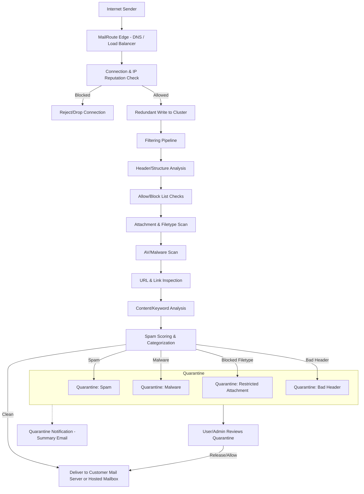
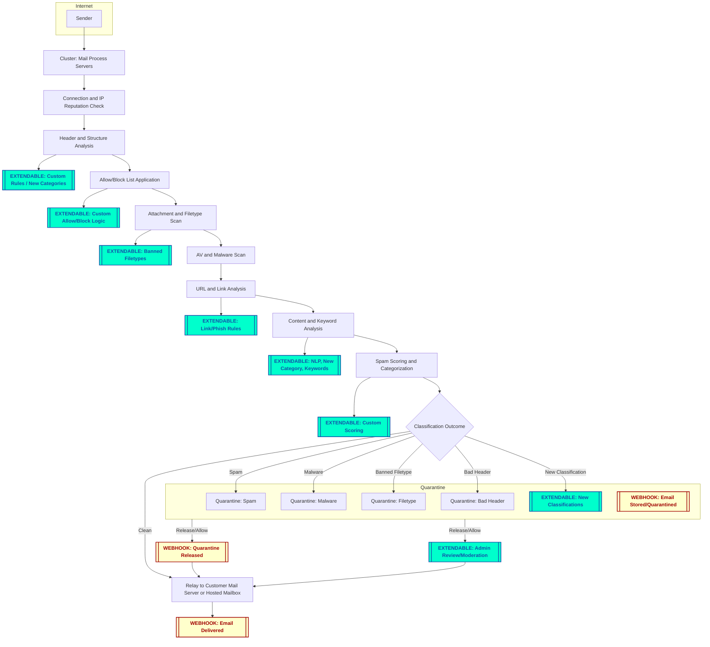

### MailRoute Email Flow and Processing

```mermaid
---

config:

theme: redux

---

flowchart TD

A[Internet Sender] --> B[MailRoute Edge - DNS / Load Balancer]

B --> C[Connection & IP Reputation Check]

C -- Blocked --> X[Reject/Drop Connection]

C -- Allowed --> D[Redundant Write to Cluster]

D --> E[Filtering Pipeline]

E --> F[Header/Structure Analysis]

F --> G[Allow/Block List Checks]

G --> H[Attachment & Filetype Scan]

H --> I[AV/Malware Scan]

I --> J[URL & Link Inspection]

J --> K[Content/Keyword Analysis]

K --> L[Spam Scoring & Categorization]

  

subgraph QUAR["Quarantine"]

N[Quarantine: Spam]

O[Quarantine: Malware]

P[Quarantine: Restricted Attachment]

Q[Quarantine: Bad Header]

end

  

L -- Clean --> M[Deliver to Customer Mail Server or Hosted Mailbox]

L -- Spam --> N[Quarantine: Spam]

L -- Malware --> O[Quarantine: Malware]

L -- Blocked Filetype --> P[Quarantine: Restricted Attachment]

L -- Bad Header --> Q[Quarantine: Bad Header]

  
  

R -- Release/Allow --> M

QUAR --> R[User/Admin Reviews Quarantine]

  

QUAR -.-> S[Quarantine Notification -Summary Email]

```

### MailRoute Locations for possible webhooks and customization

```mermaid
---

config:

theme: redux

---

flowchart TD

  

  

subgraph Internet["Internet"]

  

A["Sender"]

  

end

  

  
  

  

A --> C["Cluster: Mail Process Servers"]

  

C --> E1["Connection and IP Reputation Check"]

  

E1 --> F1["Header and Structure Analysis"]

  

  

F1 --> X1[["EXTENDABLE: Custom Rules / New Categories"]] & G1["Allow/Block List Application"]

  

G1 --> X2[["EXTENDABLE: Custom Allow/Block Logic"]] & H1["Attachment and Filetype Scan"]

  

H1 --> X3[["EXTENDABLE: Banned Filetypes"]] & I1["AV and Malware Scan"]

  

I1 --> J1["URL and Link Analysis"]

  

J1 --> X4[["EXTENDABLE: Link/Phish Rules"]] & K1["Content and Keyword Analysis"]

  

K1 --> X5[["EXTENDABLE: NLP, New Category, Keywords"]] & L1["Spam Scoring and Categorization"]

  

L1 --> X6[["EXTENDABLE: Custom Scoring"]] & M1{"Classification Outcome"}

  

  

M1 -- Clean --> N1["Relay to Customer Mail Server or Hosted Mailbox"]

  

  

%% Group all quarantine outcomes in one box

  

subgraph QUAR["Quarantine"]

  

Q1["Quarantine: Spam"]

  

Q2["Quarantine: Malware"]

  

Q3["Quarantine: Filetype"]

  

Q4["Quarantine: Bad Header"]

  

X8[["EXTENDABLE: New Classifications"]]

  

W11[["WEBHOOK: Email Stored/Quarantined"]]

  

end

  

  

M1 -- Spam --> Q1

  

M1 -- Malware --> Q2

  

M1 -- Banned Filetype --> Q3

  

M1 -- Bad Header --> Q4

  

M1 -- New Classification --> X8

  
  

  

N1 --> W9[["WEBHOOK: Email Delivered"]]

  

QUAR -- Release/Allow --> W10[["WEBHOOK: Quarantine Released"]] & X7[["EXTENDABLE: Admin Review/Moderation"]] --> N1

  

  

classDef webhook fill:#ffffcc,stroke:#a10000,stroke-width:2px,color:#a10000,font-weight:bold;

  

classDef extendable fill:#00ffcc,stroke:#134faa,stroke-width:2px,color:#134faa,font-weight:bold;

  

  

class W8,W9,W10,W11,L2 webhook;

  

class X1,X2,X3,X4,X5,X6,X7,X8,Y5,L3 extendable;

```