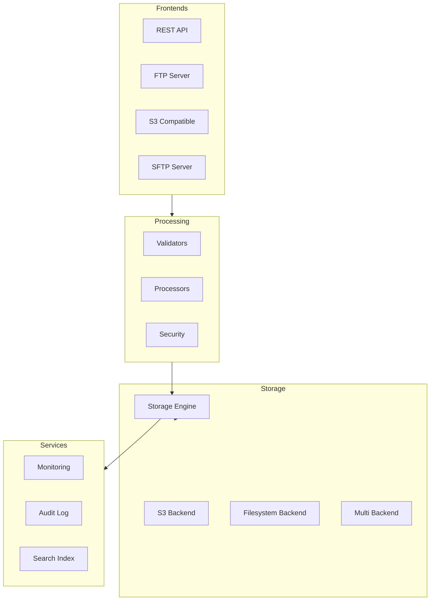

# Secure Storage Service Architecture

## Overview
A general-purpose secure storage service based on the MessageStoreService architecture, supporting multiple interfaces and content types while maintaining enterprise-grade security and reliability.

## Core Components

### 1. Storage Interface Layer
```go
// Core storage interface
type StorageEngine interface {
    // Store content with metadata and security parameters
    Store(ctx context.Context, content io.Reader, opts StoreOptions) (string, error)
    
    // Retrieve content and metadata
    Retrieve(ctx context.Context, id string) (*StoredContent, error)
    
    // List contents matching criteria
    List(ctx context.Context, filter FilterOptions) ([]ContentInfo, error)
    
    // Delete content
    Delete(ctx context.Context, id string) error
    
    // Get content metadata
    GetMetadata(ctx context.Context, id string) (*Metadata, error)
    
    // Update metadata
    UpdateMetadata(ctx context.Context, id string, updates MetadataUpdates) error
}

// Store options for content
type StoreOptions struct {
    // Content metadata
    Metadata Metadata

    // Security settings
    SecurityOptions SecurityOptions

    // Storage settings
    StorageProfile string
    RetentionPeriod time.Duration
    Compression bool

    // Processing options
    ValidationRules []ValidationRule
    ProcessingPipeline []Processor
}

// Security options
type SecurityOptions struct {
    EncryptionEnabled bool
    SigningKeyID string
    AccessControl AccessControlList
    RequireSignatureVerification bool
}

// Metadata for stored content
type Metadata struct {
    ID string
    ContentType string
    Size int64
    Created time.Time
    Modified time.Time
    Owner string
    Tags map[string]string
    CustomMetadata map[string]interface{}
    
    // Security metadata
    Signatures SignatureInfo
    Encryption EncryptionInfo
    
    // Compliance metadata
    RetentionPeriod time.Duration
    ComplianceFlags []string
    AuditTrail []AuditEvent
}
```

### 2. Frontend Interfaces

#### HTTP/REST API
```go
type RESTServer struct {
    engine StorageEngine
    auth   Authenticator
}

func (s *RESTServer) HandleUpload(w http.ResponseWriter, r *http.Request) {
    // Handle multipart upload
    // Apply content validation
    // Store via storage engine
}

func (s *RESTServer) HandleDownload(w http.ResponseWriter, r *http.Request) {
    // Authenticate request
    // Retrieve content
    // Stream to client
}
```

#### FTP Interface
```go
type FTPServer struct {
    engine StorageEngine
    auth   Authenticator
}

func (s *FTPServer) HandleSTOR(c *ftpConn, path string) error {
    // Create store options from FTP context
    // Process upload stream
    // Store via storage engine
}

func (s *FTPServer) HandleRETR(c *ftpConn, path string) error {
    // Authenticate request
    // Retrieve content
    // Stream to client
}
```

#### S3-Compatible API
```go
type S3CompatServer struct {
    engine StorageEngine
    auth   Authenticator
}

func (s *S3CompatServer) HandlePutObject(req *S3Request) (*S3Response, error) {
    // Convert S3 request to store options
    // Process upload
    // Return S3-compatible response
}
```

### 3. Content Processing Pipeline

```go
// Content processor interface
type Processor interface {
    Process(ctx context.Context, content io.Reader, metadata *Metadata) (io.Reader, error)
}

// Content validator interface
type Validator interface {
    Validate(ctx context.Context, content io.Reader, metadata *Metadata) error
}

// Example processors
type AntiVirusScanner struct{}
type MetadataExtractor struct{}
type ThumbnailGenerator struct{}
type ContentIndexer struct{}

// Processing pipeline
type Pipeline struct {
    validators []Validator
    processors []Processor
}

func (p *Pipeline) Process(ctx context.Context, content io.Reader, metadata *Metadata) (io.Reader, error) {
    // Run validation
    // Execute processors
    // Return processed content
}
```

### 4. Security Layer

```go
// Access control
type AccessControl interface {
    CheckAccess(ctx context.Context, id string, operation Operation) error
    UpdatePermissions(ctx context.Context, id string, perms Permissions) error
}

// Encryption manager
type EncryptionManager interface {
    Encrypt(ctx context.Context, content io.Reader) (*EncryptedContent, error)
    Decrypt(ctx context.Context, content *EncryptedContent) (io.Reader, error)
    RotateKey(ctx context.Context, oldKeyID, newKeyID string) error
}

// Digital signature manager
type SignatureManager interface {
    Sign(ctx context.Context, content io.Reader, keyID string) (*Signature, error)
    Verify(ctx context.Context, content io.Reader, sig *Signature) error
    RotateSigningKey(ctx context.Context, oldKeyID, newKeyID string) error
}
```

### 5. Storage Backend

```go
// Backend interface
type StorageBackend interface {
    Put(ctx context.Context, key string, content io.Reader, opts PutOptions) error
    Get(ctx context.Context, key string) (io.ReadCloser, error)
    Delete(ctx context.Context, key string) error
    List(ctx context.Context, prefix string) ([]StorageObject, error)
}

// Implementations
type S3Backend struct{}
type FilesystemBackend struct{}
type MultiBackend struct {
    backends map[string]StorageBackend
}
```

### 6. Monitoring and Metrics

```go
// Metrics collector
type MetricsCollector interface {
    RecordOperation(op Operation, duration time.Duration)
    RecordError(op Operation, err error)
    RecordStorageUsage(bytes int64)
    RecordContentStats(contentType string, size int64)
}

// Health checker
type HealthChecker interface {
    CheckHealth(ctx context.Context) (*HealthStatus, error)
    RegisterCheck(name string, check HealthCheck)
}
```

## Content Processing Flow

1. **Content Reception**
   - Receive via appropriate interface (REST/FTP/S3)
   - Authenticate request
   - Initialize content metadata

2. **Content Validation**
   - Validate content type
   - Check size limits
   - Run custom validators
   - Scan for malware

3. **Content Processing**
   - Extract metadata
   - Generate previews/thumbnails
   - Index for search
   - Apply transformations

4. **Security Processing**
   - Apply encryption
   - Generate signatures
   - Set access controls
   - Record audit trail

5. **Storage**
   - Choose storage backend
   - Apply compression
   - Store content and metadata
   - Set retention policies

6. **Post-Processing**
   - Update indexes
   - Generate notifications
   - Trigger webhooks
   - Update metrics

## Implementation Strategy

1. **Phase 1: Core Refactoring**
   - Extract storage engine from SMTP service
   - Create interface abstractions
   - Implement content-type agnostic storage

2. **Phase 2: Add REST API**
   - Implement basic HTTP endpoints
   - Add authentication/authorization
   - Support multipart uploads
   - Add content streaming

3. **Phase 3: Content Processing**
   - Implement validation framework
   - Add basic content processors
   - Create processing pipeline
   - Add metadata extraction

4. **Phase 4: Additional Interfaces**
   - Add FTP server
   - Implement S3 compatibility
   - Create WebDAV interface
   - Add SFTP support

5. **Phase 5: Advanced Features**
   - Implement search
   - Add versioning
   - Support tagging
   - Add sharing features

## Deployment Architecture



## Configuration Example

```yaml
storage:
  default_backend: s3
  backends:
    s3:
      bucket: secure-storage
      region: us-west-2
      prefix: content
    filesystem:
      path: /data/storage
      compression: true

security:
  encryption:
    enabled: true
    provider: vault
    key_rotation_period: 90d
  
  signatures:
    enabled: true
    key_id: "2024-01"
    algorithms:
      - "rsa-sha256"

processing:
  validators:
    - type: antivirus
      provider: clamav
    - type: content_type
    - type: size_limit
      max_size: 1GB

  processors:
    - type: metadata_extractor
    - type: thumbnail_generator
    - type: content_indexer

frontends:
  rest:
    enabled: true
    port: 8080
    tls: true
    max_upload_size: 5GB
    
  ftp:
    enabled: true
    port: 2121
    passive_ports: "50000-50100"
    
  s3_compatible:
    enabled: true
    port: 9000
    region: us-west-2

monitoring:
  metrics:
    prometheus: true
    statsd: true
  tracing:
    enabled: true
    provider: otlp
  health_check:
    port: 8081
    path: /health
```

## Security Considerations

1. **Authentication & Authorization**
   - Multi-factor authentication support
   - Role-based access control
   - Fine-grained permissions
   - Token-based authentication

2. **Encryption**
   - Envelope encryption
   - Key rotation
   - Client-side encryption support
   - Encryption at rest and in transit

3. **Signatures**
   - Content signatures
   - Storage signatures
   - Signature verification
   - Key rotation

4. **Audit**
   - Comprehensive audit logs
   - Access tracking
   - Change history
   - Compliance reporting

5. **Network Security**
   - TLS everywhere
   - IP restrictions
   - Rate limiting
   - DDoS protection

## Performance Optimization

1. **Content Handling**
   - Streaming uploads/downloads
   - Content chunking
   - Multipart uploads
   - Parallel processing

2. **Caching**
   - Metadata caching
   - Content caching
   - Authorization caching
   - Backend connection pooling

3. **Processing**
   - Async processing
   - Worker pools
   - Resource limits
   - Priority queues

4. **Storage**
   - Intelligent compression
   - Deduplication
   - Tiered storage
   - Content distribution

## Testing Strategy

1. **Unit Tests**
   - Interface implementations
   - Content processors
   - Security components
   - Configuration handling

2. **Integration Tests**
   - Frontend interfaces
   - Storage backends
   - Security systems
   - Processing pipeline

3. **Performance Tests**
   - Upload/download speeds
   - Concurrent operations
   - Resource usage
   - Scalability limits

4. **Security Tests**
   - Penetration testing
   - Encryption verification
   - Access control validation
   - Audit log verification

## Monitoring and Observability

1. **Metrics**
   ```go
   // Storage metrics
   storage_operations_total{operation="upload|download|delete"}
   storage_operation_duration_seconds{operation="upload|download|delete"}
   storage_content_size_bytes{content_type="*"}
   storage_errors_total{operation="*",error_type="*"}

   // Processing metrics
   processing_pipeline_duration_seconds{pipeline="*"}
   processing_errors_total{processor="*",error_type="*"}
   validation_failures_total{validator="*",reason="*"}

   // Security metrics
   encryption_operations_total{operation="encrypt|decrypt"}
   signature_operations_total{operation="sign|verify"}
   access_denied_total{reason="*"}
   key_rotation_operations_total{key_type="*"}

   // Frontend metrics
   frontend_requests_total{interface="*",operation="*"}
   frontend_errors_total{interface="*",error_type="*"}
   active_connections{interface="*"}
   bandwidth_bytes{direction="in|out"}
   ```

2. **Logging**
   ```go
   type LogEntry struct {
       Timestamp   time.Time
       Level      string
       Operation  string
       Interface  string
       ContentID  string
       UserID     string
       Message    string
       Error      error
       Duration   time.Duration
       Metadata   map[string]interface{}
   }
   ```

3. **Tracing**
   ```go
   // Span attributes
   content.id
   content.type
   content.size
   operation.name
   operation.status
   interface.type
   user.id
   processing.pipeline
   storage.backend
   error.type
   ```

4. **Alerts**
   ```yaml
   alerts:
     - name: HighErrorRate
       condition: rate(storage_errors_total[5m]) > 0.01
       severity: warning

     - name: StorageLatency
       condition: histogram_quantile(0.95, storage_operation_duration_seconds) > 1.0
       severity: warning

     - name: ProcessingBacklog
       condition: processing_queue_size > 1000
       severity: warning

     - name: SecurityFailure
       condition: rate(access_denied_total[5m]) > 0.1
       severity: critical
   ```

## Compliance and Auditing

1. **Audit Events**
   ```go
   type AuditEvent struct {
       EventID     string
       Timestamp   time.Time
       UserID      string
       Action      string
       ResourceID  string
       Status      string
       Details     map[string]interface{}
       IPAddress   string
       UserAgent   string
   }
   ```

2. **Retention Policies**
   ```go
   type RetentionPolicy struct {
       Duration    time.Duration
       LockType    string // None, Governance, Compliance
       Extensions  []string
       Conditions  []RetentionCondition
   }
   ```

3. **Compliance Features**
   - WORM (Write Once, Read Many)
   - Legal holds
   - Retention enforcement
   - Audit trails
   - Data sovereignty
   - Access logs

This architecture provides a flexible, secure, and scalable foundation for building various types of secure storage services while maintaining the robust security features of the original MessageStoreService.
